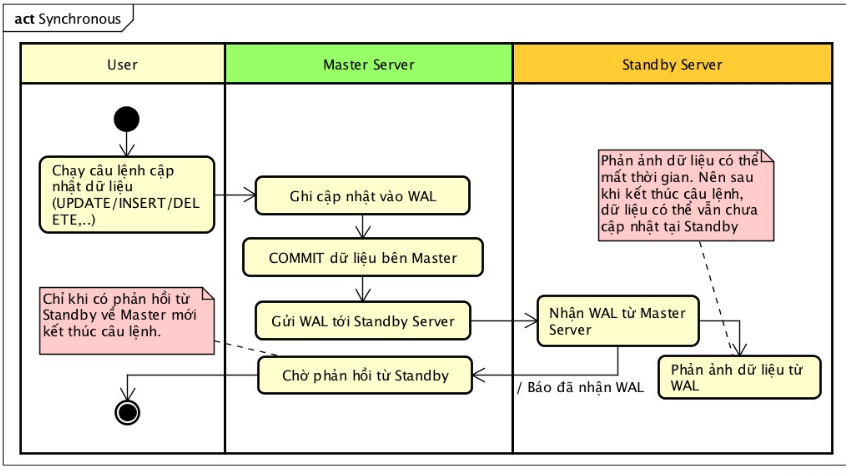

# Tìm hiểu về Replication/sync trong Mysql, Redis, Postgresql
### Mục lục

[I. Replication trong Mysql](#mysql)

[II. Replication trong Redis](#redis)

[III. Replication trong Postgresql](#postgresql)


---    


### <a name="mysql"></a>I.  Replication trong Mysql
Replication cho phép dữ liệu từ một database server (Master) được sao chép tới một hoặc nhiều database server (Slaves).

***Ưu điểm của replication trong mysql***
- Scale-out solutions : Giảm tải cho server master do được phân tải cho slave, giúp cải thiện hiệu năng hệ thống.
- Data security : vì dữ liệu được sao chép đến slave, slave có thể ngừng quá trình sao chép và nó có thể chạy dịch vụ backup trên slave mà không làm ảnh hưởng tới dữ liệu trên master.
- Analytics : Dữ liệu được tạo trên master, trong khi phân tích thông tin có thể được thực hiện trên slave mà không ảnh hưởng đến hiệu suất của Master.
- Phân phối dữ liệu từ xa : bạn có thể sử dụng replicate để tạo bản copy dữ liệu cục bộ để sử dụng mà không yêu cầu quyền truy cập vĩnh viễn vào Master.

***Một số đặc điểm của Mysql Replication***
<ul>
<li>Replication trong mysql mặc định là bất đồng bộ, các slave không cần kết nối vĩnh viễn tới master để nhận các bản cập nhật từ master. Tùy thuộc vào cấu hình, ta có thể replicate tất cả cơ sở dữ liệu hoặc chọn cơ sở dữ liệu cụ thể, hoặc thậm chí chọn một bảng trong cơ sở dữ liệu. </li>
<li>Mysql hỗ trợ nhiều replication khác nhau. Phương pháp truyền thống là dựa trên replication event từ binary log của Master và yêu cầu các log file và position của chúng để đồng bộ giữa Master và Slave. Phương thức mới hơn là dựa trên global transaction identifiers (GTIDs) là một transaction do đó không đòi hỏi làm việc với các tệp nhật ký hoặc các vị trí của các tệp này, làm đơn giản hóa rất nhiều công việc replication phổ biến. Replication bằng cách sử dụng GTIDs đảm bảo sự nhất quán giữa Master và Slave miễn là tất cả các transaction committed trên Master cũng đã được áp dụng trên Slave.</li>

<li>Replication in MySQL nhiều loại đồng bộ(synchronization) khác nhau.  Loại đồng bộ ban đầu là một chiều., asynchronous replication, trong đó một server đóng vai trò là master, và các server khác đóng vai trò như slave. Điều này trái ngược với việc nhân bản đồng bộ (synchronous) là một đặc trưng của Mysql Cluster NDB. Ngoài ra trong Mysql 8.0 còn hỗ trợ semisynchronous replication. </li>
</ul>

***Nguyên tắc hoạt động của Replication***


**Trên Master:**
- Tất cả các kết nối từ Application tới Master DB sẽ mở một Session_Thread khi có nhu cầu ghi dữ liệu. Session_Thread sẽ ghi các câu lệnh SQL vào một file binlog (ví dụ với format của binlog là statement-based hoặc Row based )
- Mọi thay đổi dữ liệu trên master (insert, delete, update) được ghi ra file bin-log.
- Dum  thread chạy trên master sẽ đọc dữ liệu từ file bin-log và chuyển sang slave.

**Trên Slave**
 - Slave IO thread nhận dữ liệu từ master và lưu trữ chúng trong file relay-log.
 - Slave sql thread sẽ đọc dữ liệu từ file relay-log và thực hiện câu lệnh sql đọc được.

***Một số chức năng đồng bộ trong Mysql Replication***

**Asynchronous replication**
 - MySQL Replication mặc định là Asynchronous. Đây là cơ chế lâu đời nhất, phổ biến và được triển khai rộng rãi nhất. Sao chép không đồng bộ có nghĩa là transaction được hoàn thành trên môi trường cục bộ hoàn toàn, và không bị ảnh hưởng bởi các replication slaves.
 - Không có gì đảm bảo rằng dữ liệu sẽ được chuyển đến slave.


**Semi-synchronous replication**
 - Nhân bản bán đồng bộ nghĩa là Slave và Master giao tiếp với nhau để đảm bảo việc chuyển giao giao dịch chính xác. Master chỉ điền vào binlog và tiếp tục phiên của nó nếu một trong các Slave xác nhận giao dịch. Mà giao dịch chỉ được xác nhận khi các sự kiện được ghi vào Relay Log của Slave.


**Percona XtraDB Cluster / Galera Cluster (Synchronous Replication)**
 - Giải pháp này tập trung vào việc cung cấp tính nhất quán và cũng sử dụng quy trình chứng nhận để đảm bảo rằng các transactions tránh xung đột và được thực hiện chính xác.Có thể nói Percona XtraDB Cluster một giải pháp sẵn sàng cao và khả năng mở rộng cao cho người sử dụng MySQL.

=> Mỗi loại phương pháp đồng bộ đều có ưu điểm và hạn chế riêng, vì thế tùy thuộc vào từng bài toán mà ta sẽ đưa ra những giải pháp tốt nhất cho doanh nghiệp.

### Triển khai Percona XtraDB Cluster + Haproxy, Keepalive trên Ubuntu 16.04

Cài đặt  Percona XtraDB Cluster
Cài đặt các gói cần thiết và update :
```
wget https://repo.percona.com/apt/percona-release_0.1-4.xenial_all.deb
sudo dpkg -i percona-release_0.1-4.xenial_all.deb
sudo apt-get update
```
Cài đặt Percona XtraDB
```
sudo apt-get install -y percona-xtradb-cluster-57
```
Tiến hành cấu hình trên các node
Trước khi cài đặt ta cần stop mysql trên cả 3 node
```
/etc/init.d/mysql stop
```
Cấu hình trên node PXC1:
Cấu hình trong file  **/etc/mysql/percona-xtradb-cluster.conf.d/wsrep.cnf** với nội dung như sau:


```
[mysqld]
# Path to Galera library
wsrep_provider=/usr/lib/galera3/libgalera_smm.so

# Cluster connection URL contains IPs of nodes
#If no IP is found, this implies that a new cluster needs to be created,
#in order to do that you need to bootstrap this node
wsrep_cluster_address=gcomm://10.5.9.204,10.5.9.196,10.5.9.203

# In order for Galera to work correctly binlog format should be ROW
binlog_format=ROW

# MyISAM storage engine has only experimental support
default_storage_engine=InnoDB

# Slave thread to use
wsrep_slave_threads= 8

wsrep_log_conflicts

# This changes how InnoDB autoincrement locks are managed and is a requirement for Galera
innodb_autoinc_lock_mode=2

# Node IP address
wsrep_node_address=10.5.9.204
# Cluster name
wsrep_cluster_name=pxc-cluster

#If wsrep_node_name is not specified,  then system hostname will be used
wsrep_node_name=pxc1

#pxc_strict_mode allowed values: DISABLED,PERMISSIVE,ENFORCING,MASTER
pxc_strict_mode=ENFORCING

# SST method
wsrep_sst_method=xtrabackup-v2

#Authentication for SST method
wsrep_sst_auth="vinhbv:vinhbv123"
```

Start node đầu tiên với lệnh:
```
/etc/init.d/mysql bootstrap-pxc
```

```
mysql> CREATE USER 'vinhbv'@'localhost' IDENTIFIED BY 'vinhbv123';
mysql> GRANT PROCESS, RELOAD, LOCK TABLES, REPLICATION CLIENT ON *.* TO 'vinhbv'@'localhost';
mysql> FLUSH PRIVILEGES;
mysql> exit;
```

Trên Node PXC2:
Cấu hình tương tự Node 1 trong file /etc/mysql/percona-xtradb-cluster.conf.d/wsrep.cnf và chỉ sửa dòng:
```
wsrep_node_addres=10.5.9.196
wsrep_node_name=pxc2
```
Khởi động MySQL lên:
```
/etc/init.d/mysql start
```

Trên Node PXC3:
Cấu hình tương tự Node 1 trong file /etc/mysql/percona-xtradb-cluster.conf.d/wsrep.cnf và chỉ sửa dòng

```
wsrep_node_addres=10.5.9.203
wsrep_node_name=pxc3
```

Khởi động MySQL lên:
```
/etc/init.d/mysql start
```
***Test replication***

Để kiểm tra replication, chúng ta sẽ thử tạo 1 cơ sở dữ liệu mới trên node pxc2, 1 bảng cho CSDL mới đó trên node pxc3 và thêm một số bản ghi trên node pxc1.

Trên Node pxc2: Ta tạo 1 CSDL mới
```
mysql> CREATE DATABASE percona;
Query OK, 1 row affected (0.01 sec)
```
Tạo table trên node pxc3
```
mysql> USE percona;
Database changed

mysql> CREATE TABLE example (node_id INT PRIMARY KEY, node_name VARCHAR(30));
Query OK, 0 rows affected (0.05 sec)
```
Insert bản ghi trên node pxc1
```
mysql> INSERT INTO percona.example VALUES (1, 'percona1');
Query OK, 1 row affected (0.02 sec)
```

Ta sẽ kiểm tra quá trình đồng bộ ở cả 3 node và kết quả như sau.
```
mysql> SELECT * FROM percona.example;
+---------+-----------+
| node_id | node_name |
+---------+-----------+
|       1 | percona1  |
+---------+-----------+
1 row in set (0.01 sec)

```

##### Cấu hình Load-balancing sử dụng HAProxy
Trước khi cấu hình cân bằng tải, ta cần tạo 2 user, 1 dùng cho HAProxy check status  ( cơ bản là health check), 1 dùng để connect mysql cluster. Vì các node tự đồng bộ nên ta chỉ cần tạo user trên 1 node.

Tạo user dùng cho Haproxy check status
```
mysql -u root -p -e "INSERT INTO mysql.user (Host,User,ssl_cipher,x509_issuer,x509_subject) values ('10.5.9.55','mysql_haproxy_check','','',''); FLUSH PRIVILEGES;"

mysql -u root -p -e "INSERT INTO mysql.user (Host,User,ssl_cipher,x509_issuer,x509_subject) values ('10.5.9.47','mysql_haproxy_check','','',''); FLUSH PRIVILEGES;"
```
Tạo user để kết nối với Mysql cluster
```
mysql -u root -p -e "GRANT ALL PRIVILEGES ON *.* TO 'vinhbv'@'10.5.9.55' IDENTIFIED BY 'vinhbv123' WITH GRANT OPTION; FLUSH PRIVILEGES;"

mysql -u root -p -e "GRANT ALL PRIVILEGES ON *.* TO 'vinhbv'@'10.5.9.47' IDENTIFIED BY 'vinhbv123' WITH GRANT OPTION; FLUSH PRIVILEGES;"
```

Cài đặt mysql client trên máy chủ Haproxy1
```
apt-get install mysql-client
```
Trên node haproxy1 kiểm tra kết nối từ haproxy đến mysql cluster thông qua user đã tạo.

```
mysql -h 10.5.9.55 -u vinhbv -p -e "SHOW DATABASES"
```
Kết quả kết nối thành công.
```
root@haproxy1:~# mysql -h 10.5.9.47 -u vinhbv -p -e "SHOW DATABASES"
Enter password:
+--------------------+
| Database           |
+--------------------+
| information_schema |
| mysql              |
| percona            |
| performance_schema |
| sys                |
| vinhkma            |
+--------------------+

```

Tiếp theo ta sẽ tiến hành cài đặt và cấu hình HAproxy
Cài đặt haproxy
```
apt-get install haproxy -y
```
Cho phép Haproxy khởi chạy khi khởi động
```
echo ENABLED=1 >> /etc/default/haproxy
```
- CHỉnh sửa cấu hình haproxy trên cả 2 node haproxy tại /etc/haproxy/haproxy.cfg với nội dung như sau:

```
global
    log 127.0.0.1 local0 notice
    user haproxy
    group haproxy

defaults
    log global
    retries 2
    timeout connect 3000
    timeout server 5000
    timeout client 5000

listen mysql-cluster
    bind 0.0.0.0:3306
    mode tcp
    balance roundrobin
    server pxc1 10.5.9.204:3306 check
    server pxc3 10.5.9.203:3306 check
    server pxc2 10.5.9.196:3306 check
listen  stats
    bind 0.0.0.0:9000
    mode http
    stats enable
    stats uri /status
    stats auth vinhbv:vinhbv123
```
Sau đó ta restart lại HAProxy
```
service haproxy restart
```
Bây giờ ta có thể truy cập vào trang http://10.5.9.55:8080/status & http://10.5.9.47:8080/status với user vinhbv và pass: vinhbv123 để kiểm tra trạng thái của cluster và việc cân bằng tải.

 

- Test Load-balancing
Ta tiến hành request tới từng IP Haproxy và theo dõi kết quả.

 

Do trên cấu hình Haproxy sử dụng thuật toán cân bằng tải roundrobin nên mỗi lần request thì kết quả sẽ trả về xoay vòng từng database server.

- Cuối cùng cấu hình Keepalived trên 2 node cài đặt Haproxy
```
apt-get install keepalived -y
```
- Cấu hình file config Keepalived tại /etc/keepalived/keepalived.conf

Trên node Haproxy1 cấu hình như sau:
```
global_defs {
   notification_email {
     mysql-user@mydomain.com
   }
   notification_email_from svr1@mydomain.com
   smtp_server localhost
   smtp_connect_timeout 30
}
vrrp_instance VRRP1 {
    state MASTER
#   Specify the network interface to which the virtual address is assigned
    interface eth0
#   The virtual router ID must be unique to each VRRP instance that you define
    virtual_router_id 71
#   Set the value of priority higher on the master server than on a backup server
    priority 200
    advert_int 1
    authentication {
        auth_type PASS
        auth_pass 1066
    }
virtual_ipaddress {
10.5.68.121
}
}
```

Trên node Haproxy2 cấu hình như sau:
```
global_defs {
   notification_email {
     mysql-user@mydomain.com
   }
   notification_email_from svr2@mydomain.com
   smtp_server localhost
   smtp_connect_timeout 30
}

vrrp_instance VRRP1 {
    state BACKUP
#   Specify the network interface to which the virtual address is assigned
    interface eth0
#   The virtual router ID must be unique to each VRRP instance that you define
    virtual_router_id 71
#   Set the value of priority higher on the master server than on a backup server
    priority 100
    advert_int 1
    authentication {
        auth_type PASS
        auth_pass 1066
    }
virtual_ipaddress {
10.5.68.121
}
}
```
Sau đó restart lại keepalived
```
/etc/init.d/keepalived restart
```
Ở đây ta cấu hình Haproxy1 là Master chứa VIP, và haproxy2 sẽ là backup cho haproxy. Khi Haproxy1 bị down thì VIP sẽ chuyển sang haproxy2 và lúc này haproxy2 sẽ lên làm Master.

- Do haproxy 1 là Master nên card eth0 sẽ có thêm VIP
 
 - Card eth0 trên node haproxy2
  

Để  test failover ta sẽ down interface eth0 trên node haproxy1
```
ifdown eth0
```
 Bây giờ node haproxy 2 sẽ nhận VIP
  

---

### <a name="redis"></a>II.  Replication trong Redis

Redis là 1 trong số các hệ quản trị cơ sở dữ liệu phát triển mang phong cách NoSQL.Khác với RDMS như MySQL, hay PostgreSQL, Redis không có bảng. Redis lưu trữ data dưới dạng key-value.

Redis replication rất đơn giản để sử dụng và cấu hình master-slave replication,cho phép các Redis slave trở thành Redis Master khi Master cũ gặp sự cố.

Redis sử dụng mặc định là asynchronous replication.

Để đảm bảo tính HA and failover thì ta có thể sử dụng Redis Sentinel  hoặc Redis Cluster. Ở đây tôi sẽ giới thiệu về Sentinel.

### Các khả năng mà Redis Sentinel cung cấp
<ul>
<li>Monitoring: Sentinel liên tục kiểm tra xem Master và Slave instance có hoạt động như mong đợi hay không.</li>
<li>Notification: Sentinel có thể thông báo cho người quản trị hệ thống, hoặc một chương trình máy tính khác, thông qua API, rằng có điều gì đó không đúng với một trong các Redis instances được giám sát.</li>
<li>Automatic failover: Nếu Master gặp sự cố nó sẽ bầu slave khác lên làm Master</li>
</ul>

***Cơ chế hoạt động***
<ul>
<li>Các sentinel sẽ luôn quan sát master server, khi master down, các sentinels sẽ loan truyền nhau 1 tín hiệu sdown: tao thấy đại ca chết rồi thì phải.</li>
<li>Khi đủ 1 số lượng n sentinel đồng ý rằng nó cũng thấy master bị down, thì các sentinels sẽ loan tiếp tín hiệu odown: nó thực sự chết rồi đó.</li>
<li>Lúc này, các sentinels sẽ bầu chọn ra 1 slave để nâng cấp lên làm master mới, đồng thời cập nhật các cấu hình theo bộ máy chính quyền mới.</li>
<li>Khi thằng master kia sống lại, nó sẽ được tham gia vào băng nhóm với vai trò slave.</li>
</ul>


#### Mô hình triển khai Redis Master-Slave, auto failover với sentinel


master: 192.168.1.128
slave-1: 192.168.1.133
slave-2: 192.168.1.134

Cài đặt redis

Cài redis vào CẢ 3 NODE

```
sudo apt-add-repository ppa:chris-lea/redis-server
sudo apt-get update
sudo apt-get install redis-server -y
```
Cấu hình cho node master
Mở file /etc/redis/redis.conf lên và cấu hình
Tìm đến dòng bind 127.0.0.1, đây là khai báo redis server sẽ lắng nghe request ở đâu.
Với cấu hình mặc định thì nó chỉ lắng nghe từ localhost, nên ta đổi về IP của node
```
bind 192.168.1.128
```
Lưu lại file sau đó khởi động lại redis server
```
sudo systemctl restart redis-server.service
```
Cấu hình cho các node slave
Tiếp đến, mở file /etc/redis/redis.conf lên và cấu hình:
```
bind 192.168.1.133
```
slave 2
```
bind 192.168.1.134
```
Tiếp, tìm đến dòng có ***slaveof <masterip> <masterport>*** điền vào:
```
slaveof 192.168.1.128 6379
```
Cấu hình này sẽ khai báo đây là node dự bị (slave) cho node chính 192.168.1.128 và liên lạc với nó thông qua cổng 6379-cổng mà bên kia đang lắng nghe.

Sau đó khởi động lại redis server:
```
sudo systemctl restart redis-server.service
```

Cài đặt sentinel trên CẢ 3 NODE:
```
sudo apt-get install redis-sentinel -y
```
Mở file /etc/redis/sentinel.conf và cấu hình:
```
daemonize yes
pidfile "/var/run/redis/redis-sentinel.pid"
logfile "/var/log/redis/redis-sentinel.log"
 bind 192.168.1.128
port 26379
 sentinel monitor mymaster 192.168.1.128 6379 2
sentinel down-after-milliseconds mymaster 2000
sentinel failover-timeout mymaster 180000
sentinel parallel-syncs mymaster 1
```
Giải thích cấu hình:
 - bind 192.168.1.128: báo cho các sentinel ở node khác biết rằng n đang lắng nghe ở địa chỉ này.
 - port 26379:  cổng sentinel.
sentinel monitor mymaster 192.168.1.128 6379 2: lệnh này khai báo nó sẽ lắng nghe master ở địa chỉ 192.168.1.128:6379, tham số cuối cùng (2) là số lượng sentinel tối thiểu để tham gia việc bầu chọn (lúc xác định Maser down, và bầu Master mới), còn mymaster là cái có thể đặt tùy ý.
 - sentinel down-after-milliseconds mymaster 2000: sau 2000 mili giây mà không thấy đại ca phản hồi thì tao sẽ loan tin sdown đi.

Config cho 2 slave server cũng tương tự cho master, chỉ khác 1 chỗ duy nhất là địa chỉ để bind-dùng IP của slave server tương ứng:
```
daemonize yes
pidfile "/var/run/redis/redis-sentinel.pid"
logfile "/var/log/redis/redis-sentinel.log"

bind 192.168.1.133
port 26379

sentinel monitor mymaster 192.168.1.128 6379 2
sentinel down-after-milliseconds mymaster 2000
sentinel failover-timeout mymaster 180000
sentinel parallel-syncs mymaster 1
```
Cuối cùng khởi động lại cả 3 sentinel:
```
sudo systemctl restart redis-server.service
```
Ok, vậy là cấu hình replication đã xong
Kiểm tra thông tin về replication trên db1:

Như trên hình ta thấy server 192.168.1.128 đóng vai trò là master và kết nối với 2 slave có địa chỉ ip 192.168.1.133 và 192.168.1.134  
***Test replication***
Trên node Master ta ghi dữ liệu vào để test

```
redis-cli -h 192.168.1.128
192.168.1.128:6379> set test 'this key was defined on the master server'
OK
```
Trên 2 node slave ta thử đọc dữ liệu ở bên server master được đồng bộ sang:
```
 redis-cli -h 192.168.1.133
 192.168.1.133:6379> get test
 'this key was defined on the master server'
```
Test automatic failover
- Để test auto failover ta sẽ lần lượt down service redis trên từng node, để xem quá trình bầu master mới tự động diễn ra ntn.

-Như ở trên trên thì db1 đang giữ vai trò master, bây giờ ta sẽ đánh sập master bằng cách stop serivce
```
sudo systemctl stop redis-server.service
```
Mở các file log ra để xem quá trình bầu master mới trên node db2,db3:
```
tailf /var/log/redis/redis-sentinel.log
```
Lúc này log sẽ hiển thị các thông tin về quá trình bầu Master mới như sau


Nhìn vào log ta thấy sau khi Master bị down, quá trình bầu Master mới diễn ra, và node slave1 với địa chỉ 192.168.1.133 lên làm Master mới. Và node Master cũ sẽ chuyển xuống làm slave. Nghĩa là khi Master cũ được phục hồi thì nó sẽ làm Slave.

Bây giờ ta thử kiểm tra thông tin Replication trên node slave1 xem có đúng nó đóng vai trò Master trong quá trình bầu Master mới.


Ok vậy là slave-1 đã trở thành Master mới và do Master cũ đã bị down, nên lúc này số lượng slave chỉ còn lại 1 là slave2.

Tiếp theo ta tiếp tục stop service slave1 đang đóng vai trò Master.
```
sudo systemctl stop redis-server.service
```
Quá trình bầu Master mới tiếp tục diễn ra như sau


- Kiểm tra thông tin replication trong slave2


-----------------------------------------------------------------
### <a name="postgresql"></a>III.  Replication trong PostgreSQL

Replication là một trong chức năng không thể thiếu của một số RDBMS nói chung và PostgreSQL(Streaming Replication) nói riêng. Ở PostgreSQL bạn có thể liên kiết với một số cluster soft như Pacemaker, hay pgpool-II để triển khai hệ thống High Availablity cho môi trường của bạn. Nguyên lý Streaming Replication của PostgreSQL dựa trên việc chuyển WAL (Transaction log) từ node Master tới Standby, sau đó Standby phản ánh lại nội dung WAL vào dữ liệu.

Chức năng replication của PostgreSQL đầu tiên được thêm vào ở phiên bản 9.0. Sau nhiều cải tiến qua các phiên bản. Hiện tại replication nổi bật với chức năng logical replication trên phiên bản  PostgreSQL-10.
Quá trình phát triển chức năng replication qua từng phiên bản.


#### Giải thích một số chức năng đồng bộ quan trọng
</ul>
<li> ***Chức năng thiếu đồng bộ - Asynchronous*** (PostgreSQL 9.0). </li>
Chức năng này gọi là thiếu đồng bộ. Vì dữ liệu cập nhật ở phía Master không được cập nhật tức thì ở Standby, và Master không biết được răng Standy đã nhận được WAL chưa.


<li>***Chức năng tiền đồng bộ*** - Synchronous (PostgreSQL 9.1) </li>
Tiến bộ hơn chức năng Asynchronous, ở chế độ Synchronous Standby Server gửi thông điệp thành công tới Master Server sau khi xác nhận đã nhận được thông tin WAL(Transaction log). Sau khi nhận được được thông điệp từ Standby Server, Master kết thúc xử lý cập nhật dữ liệu. Như vậy sau khi cập nhật dữ liệu ở Master Sever, phải chờ một chút thời gian (thường thì khoảng vài micro giây) để Standby phản ánh (recovery) dữ liệu đó từ WAL vừa nhận được. Nhưng có vấn đề là việc phản ánh dữ liệu mất thời gian nên sau khi kết thúc câu lệnh, dữ liệu có thể vẫn chưa được cập nhật tại Standby.
Chia tiết về quá trình đồng bộ xem hình bên dưới.


<li>***Chức năng Full Synchronous*** </li>
Cải tiến nhược điểm của chức năng synchronous, ở chức năng này sau khi kết thúc câu lệnh cập nhật dữ liệu ở Master Server, có thể đảm bảo là dữ liệu sẽ chắc chắn đã được cập nhật ở Standby Server.


<li>***Logical Replication***</li>
 - Cho phép PostgreSQL có thể Replication giữa các phiên bản khác nhau,
 - Logical Replication  sử dụng mô hình publish và subscribe với một hoặc nhiều subscribe. Mô hình này subscribe sẽ pull  dữ liệu từ các publications mà họ subscribe và sau đó có thể  re-publish dữ liệu để cho phép cascading replication hoặc cấu hình phức tạp hơn.
 - Logical replication của bảng thường được bắt đầu bằng việc snapshot dữ liệu trên cơ sở dữ liệu của publisher và copy dữ liệu đó cho subscriber. Khi đã xong, các thay đổi trên publisher sẽ được gửi đến subscribe theo thời gian thực.


</ul>

Master Slave Replication Postgresql là việc chạy song song hai database cùng một lúc. Master sẽ đóng vai trò là database chính để người thao tác trên đó. Trong khi đó, Slave sẽ đóng vai trò là 1 database phụ, nó có trách nhiệm chạy khi Master ngưng hoạt động. Tuy nhiên database Slave chỉ cho phép đọc dữ liệu, không cho phép ghi hay xóa dữ liệu. Hai database master và slave hoạt động song song và luôn trao đổi dữ liệu qua lại.

=> Để đảm bảo tính high availability (HA) thì ta cần trển khai Postgresql Master-Slave tích hợp với Pgpool-II và Watchdog. Có thể nói Pgpool2 giống Haproxy để Load Balancing còn Watchdog đóng vai trò như K

### Triển khai Master-Slave trong Postgresql
**Bước 1 - Cài đặt PostgreSQL 9.6**
 - Add repository postgreSQL 9.6 vào trong thư mục sources.list.d
```
echo 'deb http://apt.postgresql.org/pub/repos/apt/ xenial-pgdg main' | tee /etc/apt/sources.list.d/postgresql.list
```
 - Sau đó import  PostgreSQL signing key
```
wget -q https://www.postgresql.org/media/keys/ACCC4CF8.asc -O - | sudo apt-key add -
```
 - Sau đó update lại hệ thống
```
apt-get update
```
 - Tiếp theo, cài đặt package PosgreSQL 9.6
```
apt-get install -y postgresql-9.6 postgresql-contrib-9.6
```
 - Enabe chế độ tự động start khi khởi động
```
systemctl enable postgresql
```
 - Cấu hình password cho postgres user
```
su - postgres
psql
\password postgres
\conninfo
```

**Bước 2: Cấu hình PostgreSQL MASTER Server**
 - Vào thư mục cấu hình postgre trong '/etc/postgresql/9.6/main' và edit file cấu hình postgresql.conf và chỉnh sửa
```
cd /etc/postgresql/9.6/main/
vim postgresql.conf
```

 - Tại dòng *listen_addresses* ta thay đổi địa chỉ ip của Master server
```
listen_addresses = '10.5.9.78'
```
 - Tại dòng 'wal_level' thay đổi thành giá trị 'hot_standby'.
```
wal_level = hot_standby
```
 - Với synchronization level, ta sẽ sử dụng local sync
```
synchronous_commit = local
```
 - Enable archiving mode Và thay đổi archive_command với command 'cp %p /var/lib/postgresql/9.6/main/archive/%f'.
```
archive_mode = on
archive_command = 'cp %p /var/lib/postgresql/9.6/main/archive/%f'
```
 - Với cài đặt Replication, ở phần này ta sử dụng chỉ 2 server, nên trưởng *wal_sender* ta sẽ để là 2.
```
max_wal_senders = 2
wal_keep_segments = 10
synchronous_standby_names = 'pgslave001'
```
 - Vì trong file postgresql.conf,archive mode là được enabled, vì vậy chúng ta cần tạo thư mực archive mới.
```
mkdir -p /var/lib/postgresql/9.6/main/archive/
chmod 700 /var/lib/postgresql/9.6/main/archive/
chown -R postgres:postgres /var/lib/postgresql/9.6/main/archive/
```
 - Tiếp theo chỉnh sửa cấu hình xác thực trong file  pg_hba.conf
vim pg_hba.conf
```
# PostgreSQL Master IP address
host  replication     replication     10.5.9.55/22          md5
# PostgreSQL SLave IP address
host  replication     replication     10.5.9.78/22          md5
```
 -  Cuối cùng ta tiến hành  restart PostgreSQL.
```
systemctl restart postgresql
```
 - Tiếp đến, tạo user mới để replication
```
su - postgres
psql
CREATE ROLE replication WITH REPLICATION PASSWORD 'reppassword' LOGIN;
```

**Bước 3 - Cấu hình trên SLAVE Server**

SLAVE server có IP address 10.5.9.55. Và slave server chỉ có quyền read trong database.
 - Trước khi cấu hình ta stop serivce postgresql
```
systemctl stop postgresql
```
 - Đi đến thư mục cấu hình và chỉnh sửa file cấu hình;
```
cd /etc/postgresql/9.6/main/
vim postgresql.conf
```
 - Cấu hình Slave server với nội dung như sau
```
listen_addresses = '10.5.9.55'
wal_level = hot_standby
synchronous_commit = local
max_wal_senders = 2
wal_keep_segments = 10
synchronous_standby_names = 'pgslave001'
hot_standby = on
```
** Bước 4 Copy PostgreSQL Data từ MASTER sang SLAVE**

Tiép theo, chúng ta sẽ thay thế thư mục cấu hình chính postgres trên 'SLAVE' server với thư mục cấu hình chính từ 'MASTER' server.
 - Đăng nhập SLAVE server và truy cập với postgres user.
```
su - postgres
```
 - Tới thư mục postgres data'main' và backup nó bằng cách đổi tên thư mục
cd 9.6/
```
mv main main-bekup
```
 - Tạo thư mục 'main' mới là người dùng 'postgres' và đảm bảo có quyền như thư mục main-bekup
```
mkdir main/
chmod 700 main/
```
 - Tiếp theo, Copy thư mục main từ  MASTER server tới SLAVE server với pg_basebackup command, ta sẽ sử dụng replica user để thực hiện copy data
```
pg_basebackup -h 10.5.9.55 -U replication -D /var/lib/postgresql/9.6/main -P --xlog
Password:
```
 - Khi dữ liệu chuyển thành công, tới thực mục main data và tạo file recovery.conf mới.
```
cd /var/lib/postgresql/9.6/main/
vim recovery.conf
```
 - Cấu hình với nội dung như sau
```
standby_mode = 'on'
primary_conninfo = 'host=10.5.9.55 port=5432 user=replication password=reppassword@ application_name=pgslave001'
restore_command = 'cp /var/lib/postgresql/9.6/main/archive/%f %p'
trigger_file = '/tmp/postgresql.trigger.5432'
```
 - Thay đổi quyền cho file recovery.conf
```
chmod 600 recovery.conf
```
 - Cấu hình Slave server hoàn tất. giờ ta start lại service
```
systemctl start postgresql
```
**Bước 5. Test Replication**

Để test replication ta sẽ tạo table mới trên Master server và insert dữ liệu vào bảng đó, sau đó check data trong bảng đó từ Slave server
 - Trên Master server
```
sudo -u postgres psql
CREATE TABLE replica_test (hakase varchar(100));
INSERT INTO replica_test VALUES ('vccloud.vn');
INSERT INTO replica_test VALUES ('This is from Master')
```


 - Trên Slave server: Ta sẽ kiểm tra dữ liệu trên 'replica_test' table để xem dữ liệu đã được đồng bộ sang slave chưa
```
sudo -u postgres psql
select * from replica_test;
```
 - Do slave chỉ có quyền read nên trên Slave ta thử insert dữ liệu xem có thông báo lỗi hay không.


Kết luận: Như vậy ta đã cài đặt xong Master-Slave Replication, để đảm bảo tính HA thì ta sẽ cần triển khai Master Slave tích hợp với Pgpool2 và Watchdog.
